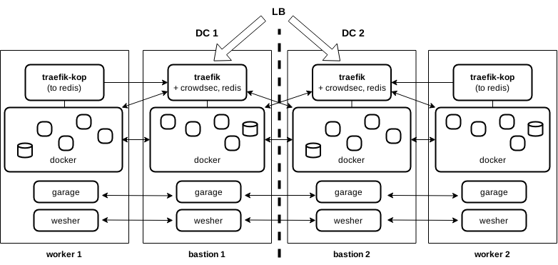

# autoops

A multi-region data and service mesh operated by a Makefile. Designed for horizontal scalability across 150–200 nodes with minimal dependencies and strict supply-chain control.



## Architecture

- **Scalability**: Fully horizontally scalable services within a mesh of up to 150–200 nodes.
- **Core Mesh Services**:
  - `wesher`: WireGuard mesh overlay network.
  - `garage`: Distributed S3-compatible object storage.
  - Docker, Traefik, Redis, and `traefik-kop`.
- **Service Discovery**: Managed by Traefik and Redis (on bastion hosts) and `traefik-kop` (on worker nodes).
- **High Availability**: Multiple parallel Traefik/Bastion hosts ensure redundancy.
  - **Ingress**: Handled by a load balancer, VPS providers (floating IPs across DCs) or DNS servers with health checks.
  - **Stateless Design**: Identical Traefik configurations and shared backend access eliminate the need for synchronized state between instances.
  - **Redis Sync**: Periodic synchronization of Redis instances enables graceful failover (e.g., by updating `--redis-addr` in traefik-kop.service on each host).
- **Bootstrapping**: The mesh is initialized from a single node marked by the `FIRST_IP` environment variable. This IP is used only during setup to bootstrap WireGuard and Garage connections. All other traffic routes through overlay IPs. `wesher/garage.py` can verify or update the first node IP via DNS.

## Supply Chain

- `docker.py`: Avoids external APT repositories by downloading packages directly from the official website.
- `services.py`: Avoids Docker Hub by building containers from local Dockerfiles.

## Usage

### 1. Prepare
- Define inventory in `inventory.py` (refer to Pyinfra documentation).
- Create a `dockerfiles/` directory containing:
  - Subdirectories for each service with a `Dockerfile` and build assets.
  - An `inventory-group.yml` Docker Compose file, matching the name of the group in `inventory.py`.

### 2. Deploy
```bash
# Bootstrap nodes and mesh
make FIRST_IP="x.x.x.x" nodes

# Build services from local Dockerfiles
make DOCKERFILES_PATH="../dockerfiles" services

# Start services
make services-up
```

### 3. Maintain
- **Rebuild a specific container** across all hosts:
  ```bash
  make SERVICE="webapp" deploy
  ```
- **Update/Upgrade APT packages** for specific host groups (e.g., `db*`):
  ```bash
  make GROUP="db*" care
  ```

## Modules & Configuration

### Prerequisites
- Debian-based system with `apt` and `systemd`.
- Prebuilt binaries located in `assets/aarch64` and `assets/x86_64`: `wesher`, `garage`, `traefik-kop`.

### Inventory Attributes
- **`hostname`** (string): Used for hostname resolution within the overlay network.
- **`behind_nat`** (bool): Enables LAN service sharing via a Bastion node (Tailscale-like functionality).
  - Requires `wesher --advertise-addr` (custom build: [neospe/wesher](https://github.com/neospe/wesher)).
  - Any node can be behind NAT, including the first node. Requires `public_ip` and SSH port forwarding.
  - Supports DynDNS by resolving `public_dns` during setup steps requiring public routable addresses.
- **`services`** (list): Service names corresponding to subdirectories in `DOCKERFILES_PATH`.
  - If you have pet servers rather than cattle, put every host in its own group, each of which has its own compose YAML.
  - **Traefik**: Requires `'traefik'` in the services list OR a `traefik_host` IP attribute. If neither is present, `services.py` installs `traefik-kop` without full configuration.
- **`zone`**: Defines Garage data replication zones. Optimal setup requires minimum 3 nodes across 3 locations.
- **SSH Configuration**:
  - Set `ssh_forward_agent=True` to integrate with a local SSH agent.
  - Keys can be managed by Pyinfra; other credentials may be handled via a vault (refer to Pyinfra documentation).

### Services
- **Assumptions**:
  - `DOCKERFILES_PATH` is defined in the environment or Makefile.
  - Structure: `DOCKERFILES_PATH/<service>/Dockerfile` and `DOCKERFILES_PATH/<inventory-group>.yml`.
- **Variables**: Assets can contain templated variables injected from the environment or another secrets handling system. Examples: `<< OVERLAY_IP >>`, `<< HOSTNAME >>`, `<< GARAGE_KEY >>`, `<< GARAGE_SECRET >>`, `<< REDIS_IP >>`, `<< REDIS_PWD >>`, `<< POSTGRES_PWD >>`, `<< SMTP_PWD >>`, `<< TRAEFIK_IP >>`.
- **Traefik**: Includes CrowdSec integration (with Docker-specific config). `traefik-kop` requires Redis running at the `traefik_host`.
- **Docker**: Uses host network mode. Services are configured to run on the overlay network. `services.py` dynamically injects overlay hostname and IP into Compose files (see Variables).

### Deployment Notes
- The `deploy` target strictly rebuilds containers; it does not update Dockerfiles or assets. Assumes Dockerfiles pull updates from internal version control or object stores.
- To update Dockerfiles: Run `make DOCKERFILES_PATH="../dockerfiles" services`.

## Extendability

- (Almost) Full ARM64 Support:
  - `docker.py`: Needs to fetch binaries from `https://download.docker.com/linux/debian/dists/<codename>/pool/stable/arm64`.
  - `services.py`: Needs to use [cs-firewall-bouncer-armv7](https://github.com/frigori/cs-firewall-bouncer-armv7).

- Extend `services.py`
  - Environment Injection: Injects variables into Compose files, Dockerfiles, and assets.
  - Database State: Supports restoration for Postgres and Redis.
  - _Note_: `chown` operations require UID/GID from inside the container context.

- Extend `deploy.py`
  - Graceful Rollouts: Use `docker-rollout` for draining containers during deployment.
  - Cache Clearing: Clears caches for Traefik and web services (add your webapp logic here).

- Maintenance (`care`)
  - Add custom backup routines in the `care.py` module.

- Logging
  - All logs are centralized under `/containers/log`. Easily monitored using tools like `lnav`.

- Unprivileged Services
  - Wesher
     - Can run as an unprivileged user.
     - Edit `wesher.service`: Set `User` and `Group`.
     - Assign binary capabilities: `setcap cap_net_admin=eip wesher`.
     - *Note*: Hosts file updates require root privileges. Alternative: Sync Wesher state to `/etc/hosts` via a separate task in `care.py`.
  - Garage
     - Configure `garage.toml`: Set `metadata_dir=/var/lib/garage/meta` and `data_dir=/var/lib/garage/data`.
     - Configure `garage.service` (`[Service]` section):
       ```ini
       StateDirectory=garage
       DynamicUser=true
       ProtectHome=true
       NoNewPrivileges=true
       LimitNOFILE=42000
       ```
  - Docker
     - Supports rootless container execution.

- Roadmap
  - Services: Generate Compose files dynamically from snippets and inventory service definitions.
  - Inventory: Model using CUE language to allow for automated inventory generation.
  - Logging: Implement a log collection service forwarding to a Grafana host.
  - Secrets Management: Integrated secrets handling system.

